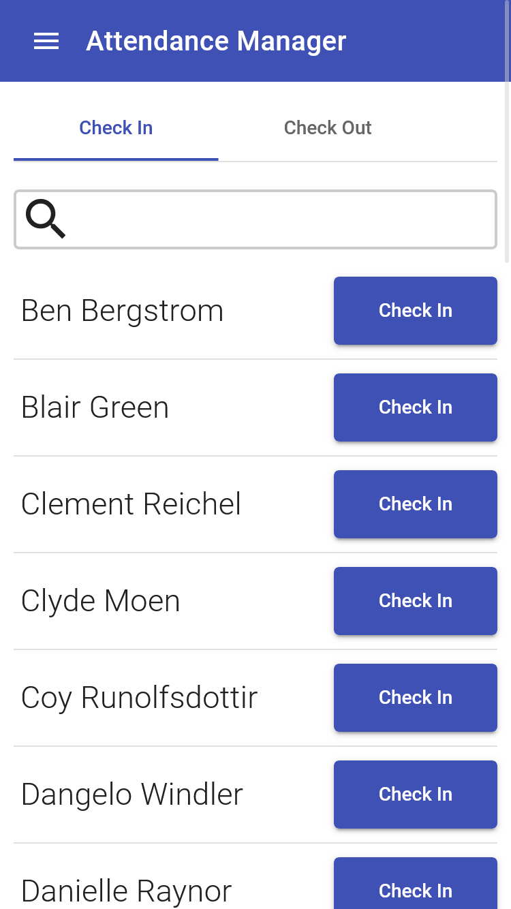
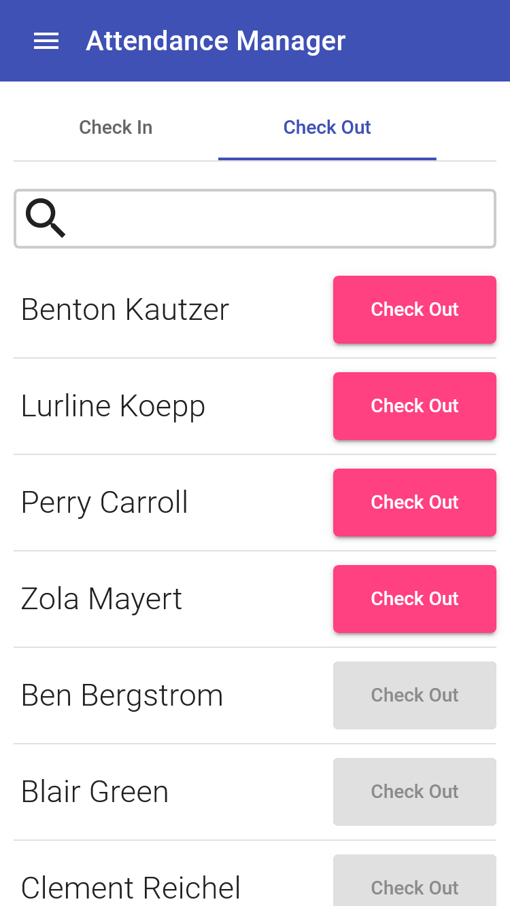
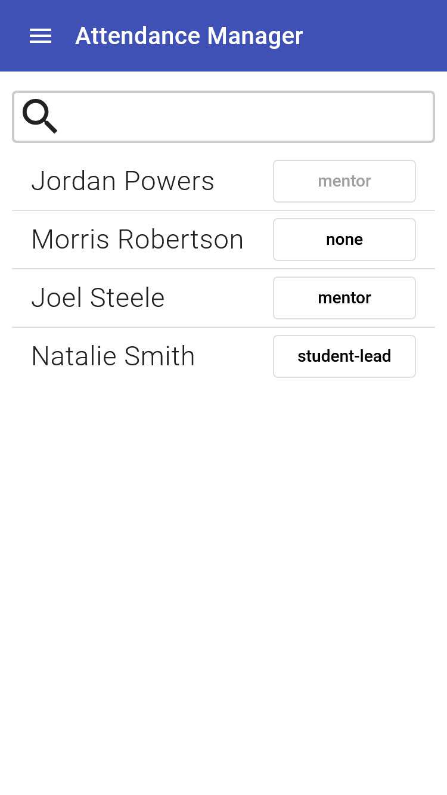
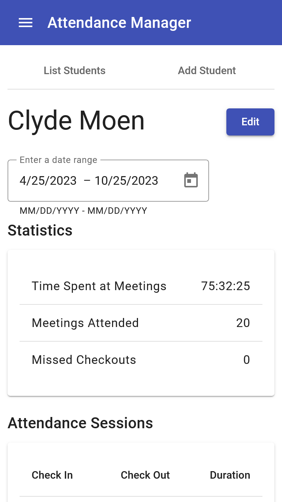
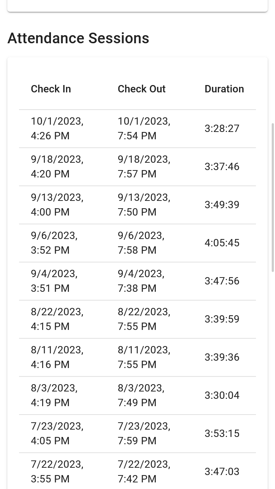
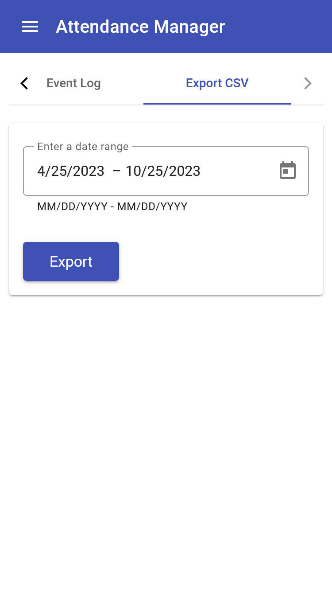
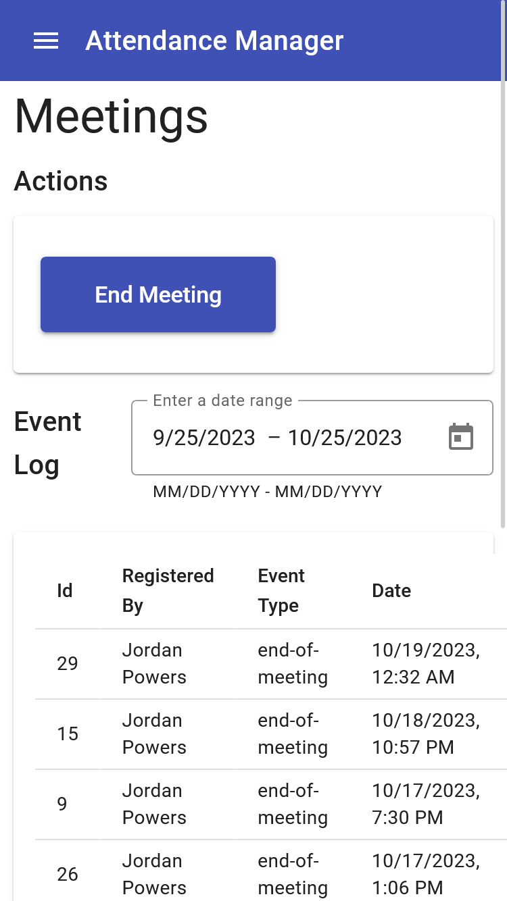
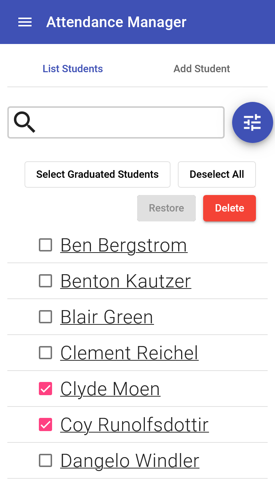

# Attendance Manager
Tracks student attendance at FRC robotics team meetings.

## Features

### Track Student Attendance
Check students in or out as they arrive at or depart from team meetings.
<p align="center">


</p>

### Different User Roles
Users can be assigned one of three roles: none, student-lead, or mentor.
Users with no role cannot access the application, student-leads have only
limited access, and mentors have full access.
<p align="center">

</p>

### Student Attendance Details
Various statistics concerning every student's attendance is tracked: total time spent
at meetings, number of meetings attended, number of missed checkouts, and a list of
attendance sessions.
<p align="center">


</p>

### Export to CSV
Student attendance data can be exported to csv for external processing.
<p align="center">

</p>

### Track Meetings
The end of team meetings can be registered manually or automatically, which will mark all students
as checked out.
<p align="center">

</p>

### Bulk Student Actions
Students can be deleted or un-deleted in bulk. Also, every student's expected
graduation year can be tracked, and graduated students can be automatically
removed from the application.

<p align="center">

</p>


# Setting up a development environment

## Prerequisites
- [Docker](https://docs.docker.com/get-docker/)
- [Visual Studio Code](https://code.visualstudio.com/), with the [Remote Development Extension Pack](https://marketplace.visualstudio.com/items?itemName=ms-vscode-remote.vscode-remote-extensionpack).

## Steps
1. Clone the repo and cd into the clone.
```
git clone git@github.com:momentumfrc/attendance-manager.git && cd attendance-manager
```
2. Open the attendance-api folder in vscode.
```
code attendance-api
```
3. When prompted, choose to reopen in container.


4. Wait for vscode to finish setting up the container.


5. You may be prompted to install recommended extensions. You should do so.

6. In the vscode console, run the following to set up the api.
```bash
php artisan key:generate
php artisan migrate --seed
php artisan storage:link
```

7. Open the attendance-web folder in a separate vscode window.
```
code attendance-api
```

8. Again, when prompted, choose to reopen in container.

9. Open a web browser and navigate to <http://localhost/>. Note: it might take a while for the
application to start up. If the page fails to load, try again in a few minutes.
