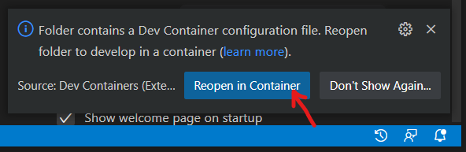
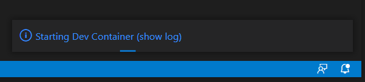

# attendance-manager
Keep track of the attendance of our team members by allowing mentors to check students in and out.

# Setting up a development environment

## Prerequisites
- [Docker](https://docs.docker.com/get-docker/)
- [Visual Studio Code](https://code.visualstudio.com/), with the [Remote Development Extension Pack](https://marketplace.visualstudio.com/items?itemName=ms-vscode-remote.vscode-remote-extensionpack).

## Steps
1. Clone the repo and cd into the clone.
```
git clone git@github.com:momentumfrc/attendance-manager.git && cd attendance-manager
```
2. Open the attendance-api folder in vscode.
```
code attendance-api
```
3. When prompted, choose to reopen in container.


4. Wait for vscode to finish setting up the container.


5. You may be prompted to install recommended extensions. You should do so.

6. Open the attendance-web folder in a separate vscode window.
```
code attendance-api
```

7. Again, when prompted, choose to reopen in container.

8. Open a web browser and navigate to <http://localhost/>. Note: it might take a while for the
application to start up. If the page fails to load, try again in a few minutes.
